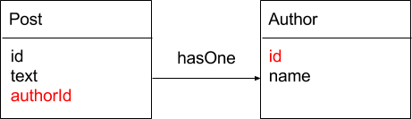
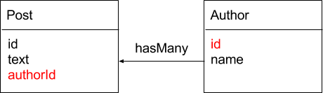
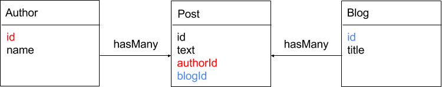

Individual object types are easy to setup, but when building real applications developers will often need to connect objects together and build relations.

With relational databases, such as MySQL, relations are included in the core system, and querying multiple objects through their relations is easily done through SQL with JOINS statements, sometimes at the expense of performance.

In NoSQL databases querying multiple, related objects turn out to be more painful as NoSQL do not handle JOINS.

And when it comes to querying two or more different databases simultaneously, developers usually answer: "No way".

Fortunately it's a pretty easy task to handle with Alambic.

You can define the following relations between object types:

* One to One
* One to Many
* Many to Many
* Embedded types

## One to One

A one to one relation between object type A and object type B defines that every instance of A "has one" instance of B. For example every "Post" has one "Author".

The declaring type (Post) has a foreign key property (authorId) that references the primary key (id) of the target type (Author).

~~~json
{
  "Post": {
    "fields": {
      "id": {...},
      "text": {...},
      "author": {
        "type": "Author",
        "relation": {
          "id": "authorId"
        }    
      }
    }
  }
}
~~~

The relation is always built as a "key:value" expression where the key is the target type key name and the value is the declaring type key name.

## One to many

A one to many relation between object type A and object type B defines that every instance of A "has many" instances of B. For example every "Author" has many "Posts".

The target type (Post) has a foreign key property that references the primary key of the declaring type (Author).

The only difference between one-to-one and one-to-many declarations is that the "multivalued" option is set to true for one-to-many.

~~~json
{
  "Author": {
    "fields": {
      "id": {...},
      "name": {...},
      "posts": {
        "type": "Post",
        "multivalued": true,
        "relation": {
          "authorId": "id"
        }    
      }
    }
  }
}
~~~

## Many to Many

A many to many relation between two object types can be established through a third type.

For example Author and Blog can share many posts.

~~~json
{
  "Post": {
    "fields": {
      "id": {...},
      "text": {...},
      "Author": {
        "type": "Author",
        "relation": {
          "id": "authorId"
        }    
      },
      "Blog": {
        "type": "Blog",
        "relation": {
          "id": "blogId"
        }    
      }      
    }
  }
}
~~~

Once configured, querying related models is straight forward:

>Author > Post > Blog

~~~code
{
  author {
    name
    posts {
      text
      blog {
        title
      }  
    }
  }
}
~~~

>Blog > Post > Author

~~~code

  blog {
    title
    posts {
      text
      author {
        name
      }
    }
  }
}
~~~

>Blog < Post > Author

~~~code

  post {
    text
    author {
      name
    }
    blog {
      title
    }
  }
}
~~~

## Embedded types
Embedded relations are used to represent a type that embeds another type.

For example a post embeds one or many comments.

~~~json
{
  "id": 1,
  "text": "My first blog post on alambic",
  "comments": [
      {"author": "John Doe", "text": "Awesome!"},
      {"author": "Jane Doe", "text": "Very useful"}
  ]
}
~~~

In Alambic every foreign field type declared without the "relation" property is considered as embedded.

~~~json
{
  "Comment": {
    "fields": {
      "author": {...},
      "text": {...}
    }
  }
}
~~~

~~~json
{
  "Post": {
    "fields": {
      "id": {...},
      "text": {...},
      "comments": {
        "type": "Comment",
        "multivalued": true
        ** no relation **
      }
    }
  }
}
~~~
